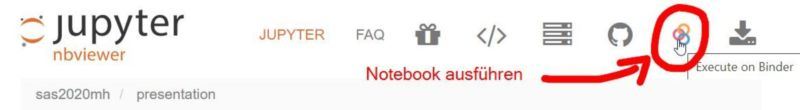
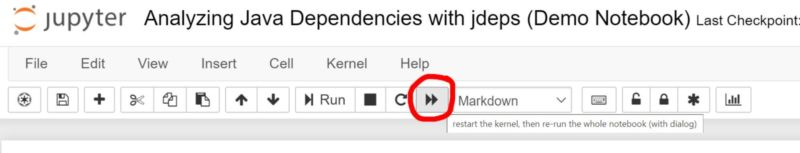

# INNOQ Technology Day

Repository für Training Bite "Software Analytics"

### Hinweise für das Ausführen

- Dieses Repository kann hier auf einer Online-Datenanalyseplattform ausgeführt werden: 
- Die unten aufgelisteten Jupyter Notebooks können auch einzeln direkt durch den Klick auf das Binder-Symbol ausgeführt werden: 

Die Notebooks selbst können auf der Online-Datenanalyseplattform über den "Run All"-Button ausgeführt werden:

## Links

* [Meine TOP 5 Empfehlungen für den Einstieg in diverse Themen (u. a. rund um Software Analytics)](https://www.feststelltaste.de/category/top5/)
* [Eine Sammlung an nützlichen Informationen zu Software Analytics (Paper, Bücher, Online-Kurse etc.)](<https://github.com/feststelltaste/awesome-software-analytics/>)

## Eigene Installation

* [Anleitung zum Installieren der Datenanalyse-Werkzeuge auf den eigenen Rechner](https://www.feststelltaste.de/saw/)

## Mehr Workshop

* [Software Analytics Workshop (2 Tage)](https://www.innoq.com/de/trainings/software-analytics/)
